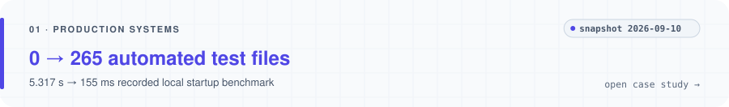
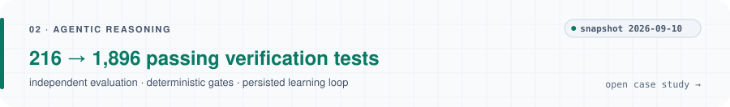
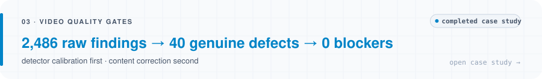

# Aman Panda

**AI Product Engineer · Agentic Systems · Full-Stack Product Engineering**

I build production software and agentic systems where generated work has to survive independent evaluation, deterministic validation and real-world failure modes.

Founding Product Engineer & Technical Lead at Clymber · Incoming MPhil in Scientific Computing (High-Performance Computing), University of Cambridge.

[Email](mailto:amanpanda36@gmail.com) · [LinkedIn](https://www.linkedin.com/in/aman-panda) · [Engineering case studies](https://github.com/Gryffin9/engineering-case-studies)

<picture>
  <source media="(prefers-color-scheme: dark)" srcset="assets/dark/hero.svg">
  
</picture>

Most production work lives in private repositories; this profile exposes only non-sensitive engineering evidence, with the measurement rules written down in [METHODOLOGY.md](https://github.com/Gryffin9/engineering-case-studies/blob/main/METHODOLOGY.md).

### Selected engineering evidence

<a href="https://github.com/Gryffin9/engineering-case-studies/blob/main/case-studies/production-systems.md">
  <picture>
    <source media="(prefers-color-scheme: dark)" srcset="assets/dark/production-card.svg">
    
  </picture>
</a>

**Hardening a production learning platform** — automated test surface **0 → 265 test files** (Feb–Sep 2026); a recorded local unchanged-content startup benchmark **5.317 s → 155 ms** by fingerprinting source state and persisting successful sync state.

<a href="https://github.com/Gryffin9/engineering-case-studies/blob/main/case-studies/agentic-reasoning.md">
  <picture>
    <source media="(prefers-color-scheme: dark)" srcset="assets/dark/agentic-card.svg">
    
  </picture>
</a>

**An evaluation-first multi-agent reasoning pipeline** — the system that creates an artifact is not the only system that judges it. Verification suite **216 → 1,896 passing tests** (Jun–Sep 2026): accumulated failure modes and contracts, not a claim that test count equals correctness.

<a href="https://github.com/Gryffin9/engineering-case-studies/blob/main/case-studies/video-quality-gates.md">
  <picture>
    <source media="(prefers-color-scheme: dark)" srcset="assets/dark/video-card.svg">
    
  </picture>
</a>

**Turning subjective video QA into measurable gates** — **2,486 raw findings → 40 genuine defects → 0 blockers.** The detector was calibrated at its source first; only then were the real defects corrected.

Evolving counts are dated snapshots (**2026-09-10**), regenerated from committed public data — see [MAINTENANCE.md](https://github.com/Gryffin9/engineering-case-studies/blob/main/MAINTENANCE.md).

### How I engineer with agents

Agents are most useful when the repository defines intent, scope, evidence requirements and failure boundaries. My workflows combine explicit task contracts, isolated development environments, deterministic validation and human acceptance.

`human intent → task contract → isolated implementation → deterministic validation → regression evidence → human acceptance`

[agentic-engineering-template](https://github.com/Gryffin9/agentic-engineering-template) is a small executable version of that loop: a valid task contract is accepted, an out-of-scope one is rejected, and CI asserts both.

### Scientific computing

Incoming MPhil in Scientific Computing, High-Performance Computing, University of Cambridge. First-author simulation and validation data for an electrostrictive metamaterial study: [electrostrictive_metamaterial_study_data_files](https://github.com/Gryffin9/electrostrictive_metamaterial_study_data_files).

### Building now

A local-first, evidence-traceable research workflow with versioned approvals and persisted recovery.

---

Interested in hard problems at the intersection of product engineering, agentic systems, evaluation and scientific computing. [amanpanda36@gmail.com](mailto:amanpanda36@gmail.com)
