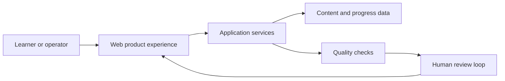

# Clymber Sanitized Case Study

This is a sanitized public case study. Clymber is a private project, and this document does not describe its private architecture, prompts, database schema, user data, unreleased roadmap, or proprietary product logic.

## Problem statement

Education products need to support repeated learning loops: practice, explanation, review, progress tracking, and content operations. The engineering challenge is to keep those loops clear for learners while keeping the underlying product reliable, maintainable, and easy to improve.

## Role

Product Builder / Technical Lead across product direction, implementation planning, full-stack engineering, quality review, and delivery discipline.

## High-level product areas

- Learner-facing practice and review flows
- Content organization and operational tooling
- Progress-oriented product experiences
- Internal engineering workflows for shipping, validation, and review

## Sanitized architecture overview

This diagram is intentionally generic. It communicates product-engineering shape without exposing private system boundaries, private data models, AI pipelines, prompts, or business logic.

## Engineering practices

- Small diffs with explicit success criteria
- Validation gates before release
- Human review loops for sensitive product changes
- Documentation that explains behavior, not just implementation
- Reproducible local workflows for debugging and iteration

## AI-assisted engineering principles

- Use structured multi-agent engineering workflows for scoped implementation tasks.
- Keep repo-specific agent rules close to the codebase.
- Define task contracts before code changes begin.
- Use isolated worktrees for parallel work where appropriate.
- Require validation gates and human-in-the-loop review before accepting changes.

## What is intentionally not shown

- Private code or implementation contracts
- Proprietary architecture or core AI pipelines
- Prompts, private business logic, or database schema
- User data, analytics internals, or unreleased features
- Internal roadmap or product strategy details

## Public takeaway

The public lesson is not the private implementation. The useful pattern is disciplined product engineering: clear user workflows, carefully scoped technical changes, repeatable validation, and review processes that keep speed and judgment connected.
